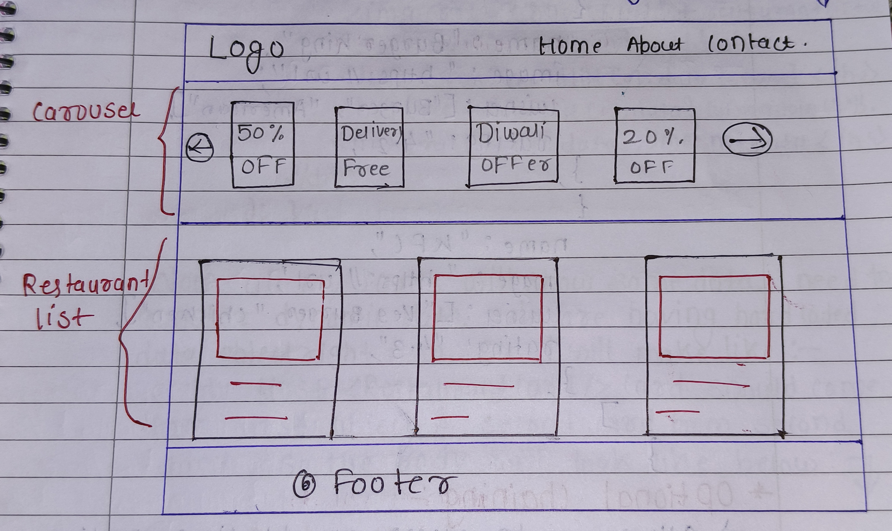
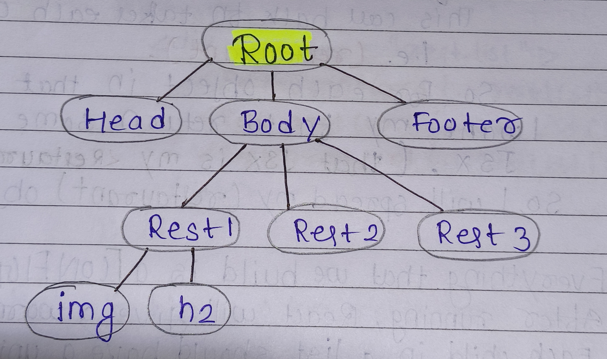

# _Talk is Cheap, Show me the code_

`"Building a Food-Ordering App"`
######  Is `JSX` mandatory for React?
<details><summary><b>Answer</b></summary>
<p>

#### Answer: No

JSX is not mandatory for React. It is a JavaScript syntax extension that makes it easier to write React components. However, it is not required to use React. You can write React components using plain JavaScript, without JSX.


</p>
</details>

######  Is `ES6` mandatory for React?
<details><summary><b>Answer</b></summary>
<p>

#### Answer: No

 ES6 is not mandatory for React. However, it is strongly recommended to use ES6 when developing React applications. ES6 provides a number of features that can make React code more concise, readable, and maintainable. For example, ES6 arrow functions, class properties, and modules can all be used to improve the readability and maintainability of React code.


</p>
</details>

######  Is `TypeScript` mandatory for React?
<details><summary><b>Answer</b></summary>
<p>

#### Answer: No

 TypeScript is not mandatory for React. You can write React code in JavaScript just fine. However, TypeScript can be a great addition to React projects for a number of reasons:
 	* Type Safey
 	* IntelliSense
 	* Documentation

</p>
</details>


## 3 ways of component composition :-
	- 1. {Title()}
	- 2. <Title/>  ---> Used generally
	- 3. <Title></Title>

## `Building our App`

* Name : Food Fest

`Whenever we are writing code, firstly do planning .`
Our App will look like this ==>


SO, our app layout should have:-
|----------------------------------|
| <h1 align="center"> Header </h1> |
| <h1 align="center"> Body </h1>   |
| <h1 align="center"> Footer </h1> |

And the code will look like =>
```js
const AppLayout =()=>{
	return (
		- Header
			- Logo 
			- Nav Items(on right side)
			- Cart
		- Body 
			- SearchBar
			- RestaurantList
				- RestaurantCard
					- Image
					- Name
					- Rating
					- Cuisines
		- Footer
			- Links
			- Copyrights
	);
}
```
---

<h1 align="center">Header Component</h1>
* For building a Header Component
```js
* Const Title=()=>{
	<a href="/">
		
	</a>
  };

* Const HeaderComponent =()=>{
	return (
		<div className = "header">
			<Title/>
			<div className = "nav-items">
				<span> Home </span>
				<span> About </span>
				<span> Contact Us </span>
			</div>
		</div>
	);
};

```
NOTE :- JSX expressions must have one parent element.
```
---

<h1 align="center">React.Fragment</h1>

* Is a component which is exported by 'React'.

```js
[import React from "react";]
```
* grouped a list of children without adding extra nodes to the DOM.
* Eg:- 
```js 
const AppLayout =()=>{
	return (
		<React.Fragment>
			<Header/>
			<Body/>
			<Footer/>
		</React.Fragment>
	);        
};
```
```
ShortHand syntax <> </> is used instead of <React.Fragment> </React.Fragment>

But we can not pass styles to empty brackets.
```
---
<h1 align="center">Giving Styling inside React</h1>

To give inline styles in react, do:-

First Method =>


```js

* const styleObj = {
	background Color: "red";
  };

* const jsx = (
	<div style = {styleObj}>
		<h1> Hello </h1>
		<h2> World </>
	</div>
  );

```
* In React, style is given using javascript objects

* Alternative way :-

```js
const jsx = (
	<div style = {{
		backgroundColor : "yellow";
	}}>
		<h1> Hello </h1>
		<h2> World </>
	</div>
);

```

Second Method =>
* Give class Name to the div( or whatever tag) and write css inside css file

  
```js
* const jsx = (
	<div className = "jsx">
		<h1> Hello </h1>
		<h2> World </>
	</div>
  );
```
* css file =>

```js
.jsx{
   backgroundColor : "red";
}
```

Third Method =>
* Using external library like
`Tailwind css`, `Bootstrap`, `MaterialUI`, etc

---

######  Can we use `React.Fragment` inside our `React.Fragment`?
<details><summary><b>Answer</b></summary>
<p>

#### Answer: Yes

We can nest `React.Fragment` components inside other `React.Fragment` components.

```js
import React from 'react';

const jsx = (
	<>
  <childA />
			<>
      <childB />
      <childC />
			</>
  <childD />
	</>
);
```
Here child B & C are sibling & will be grouped target without adding an extra node to the DOM.
</p>
</details>


---

<h1 align="center">Body Component</h1>

* While building restaurant cards, we need some data for this card. Ways :-
	* Using hard coded data
	* integrate with API

#### $\textcolor{magenta}{\textsf{ Hard coded data - code will be like =>}}$

```js
* const RestaurantCard =()=>{
	return(
		<div className = "card">
			
			<h2> Burger King </h2>
			<h3> Burger, American </h3>
			<h4> 4.3 stars </h4>
		</div>
	);
 };

* const Body = () =>{
	return (
		<div>
			<RestaurantCard />
		</div>
	);
 };

```
* The name, image and all other datas shown in the above card won't be same always. So, it should be dynamic

* As we are using JSX, we can do javascript inside HTML.

#### $\textcolor{magenta}{\textsf{ Making data dynamic =>}}$

```js
* const burgerking = {
	name : "Burger King",
	image: "some url",
	cuisines : ["Burger", "American"],
	rating:"4.3",
};
* const RestaurantCard = ()=>{
	return (
		<div className = "card">
			
			<h2>{burgerking.name} </h2>
			<h3>{burgerking.cusines.join(" , ")} </h3>
			<h4>{burgerking.rating} </h4>
        </div>
   ); 
};
```
In real world, data is not like this. There are a number of restaurants.
To render many restaurants :-

* (i) Have many restaurant cards by doing : =>
    ```js
    Const Body = () => {
        return(
			<div>
				<Restaurant Card
				<Restaurant Card />
				<Restaurant Card/>
				<Restaurant Card />
			</div>
		);
	};
    ```

* (ii)  Make all these cards dynamic :=>
	* In real world, data doesn't come like above one object. [burgerking] having Single It comes as "array of object.
    
    * It comes as `array of objects`
    * One of the obj would be that "burgerking" Similarly, there would be other objects well.


#### $\textcolor{red}{\textsf{CONFIG DRIVEN UI =>}}$

* All the UI (let say, Swiggy home  page). is driven by a config which is send backend (api) by Swiggy should work in Kolkata,

	Eg- Swiggy should work in kolkata, Dehradun, Delhi and whatever location it is , we should have different website info on each location. For that, we control our front-end using `config` That is why it is Known as <u>Config driven UI </u>. All these are controlled by backend

#### $\textcolor{green}{\textsf{How we desingn config Driven UI ?}}$

Supose, our UI is something like this => 




If our "config" is coming from backend, and my data will come like : =>
```js

const config = [
	{
		type: "carousel",
		cards:[
			{
				offerName:"50% OFF"
			},
			{
				offerName:"NO delivery Charge"
			},
		]
	},
	{
		type: "restaurants",
		cards: [
			{
				name: "Burgerking",
				image: "some url",
				cusines: ["Burger", "American"],
				rating: "4.3",
			},
			{
				name: "KFC",
				image: "some url",
				cusines: ["Burger", "American"],
				rating: "4.3",
			}
		]
	}
]
```

[ If there are no offers for a porticular location, our backend will not send us this object of empty list of cards ]
[ There offers is different for different local ]
[ Only backend will change offers & website will render accprdingly ]

#### $\textcolor{red}{\textsf{ Optional Chaining :- }}$ 

* Allows us to access an object's properties without having to check if the object or uts properties exist.
* represented by `?.`.
*  new feature introduced in javascript ES 2020

So, after taking real data from swiggy. our "Restaurant Card " function looks like this this => 

```js
* Const Restaurant Card = () => {  
 	return (
		<div className = "card>
			

			<h2>{restaurantList[0].data?.name
			} </h2>
			<h3>{restaurantList[0].data?.cousines.join(", ")} </h3>

            <h4>restaurantList[o]. date?.time} minutes </h4>
        </div>
    );
};
```
Now, all my cards will show same I need to transfer dynamic data. We are having hard coded data data. Right.

now So, I'll make like :- 
my first <ResturantCard /> card should come from fint object & second card from second object.

So, the BODY will look like below =>
```js
const Body = () => {
	return(
		<div className = "restaurant-list" >
			<RestaurantCard restaurant = {restaurantList[0]} />
			<RestaurantCard restaurant = {restaurantList[1]} />
			<RestaurantCard restaurant = {restaurantList[2]} />
			<RestaurantCard restaurant = {restaurantList[3]} />
			<RestaurantCard restaurant = {restaurantList[4]} />
		< /div>
	);
};
```
Whatever we pass is `restaurant = {restaurantList[4]` is Known as `PROPS`. And Here restaurant is the PROPS.

#### $\textcolor{magenta}{\textsf{PROPS}}$


→ Shorthand for properties.
→ "passed props" means I'm passing some data or properties into data my fumtional or class component.
→ `restaurant = {restaurantList[4]}`
This means react wraps up all these
properties cinto a variable known as
`Props`. we  can call it anything.

→ So, our Restaurant Cared function now look like =>
```js
* const RestaurantCard =(props)=>{
	return(
		<div className = "card">
			
			<h2> {props.restaurant.data?.name} </h2>
			<h3> {props.restaurant.data?.cuisnes.join(" , ")} </h3>
			<h4> {props.restaurant.data?.time}minutes </h4>
		</div>
	);
};
```

#### $\textcolor{red}{\textsf{ OBJECT DESTRUCTING :- }}$ 
```js
(props) => ({restaurant})
(restaurant.data?.name)
```

We can destructive our ({restaurant}) also =>
```js
const{name, cuisnes, cloudinaryImg, time } = restaurant.data
```

> Then [{restaurant.data?.name}] = {name}

If I dont't want to destructive like above but want to destructure everything on the flyer. Then it will look like =>
```js
const RestaurantCard = ({
	name, cuisnes, cloudinaryImgId, time	
}) = {
	return(
		<div className = "card" >
			
			<h2>{name}</h2>
			<h3> {cuisnes.join(",")} </h3>
			<h4>{time}minutes </h4>
		</div>
	);
};
``` 
Then, we have to push my individual props in Body :-
```js
const Body = () => {
	return(
		<div className = "restaurant-list" >
			<RestaurantCard 
				name = {restaurantList[0].data.name}
				cuisnes = {restaurantList[0].data.cuisines}
			 />
			<RestaurantCard 
				name = {restaurantList[1].data.name}
				cuisnes = {restaurantList[1].data.cuisines}
			 />
		< /div>
	);
};
```

```js
[ restaurantList[1].data ] This has all the props like name, cuisines, time, etc & We may want to pass all of these props. So, instead of writing each prop individually. I will do :=>
 {...restaurantList[1].data}
```

#### $\textcolor{purple}{\textsf{Spread Operator :- }}$

→ denoted by three dots(...)

→ It allows an iterable (an object that can be looped over, such as an array or a string) to be expanded in places where multiple elements are expected.

→ Eg:- multiple elements are to be written for every Restaurant and/> So, instead that we can write
```js
{...restaurantList[0].data}
```
So, my Body() fn will now look like =>

```js
const Body=()=>{
	return(
		<div className = "restaurant-List"> 
			<RestaurantCard {... restaurantList[0].data} />
			<RestaurantCard {...restaurantList[1].data}/>
			<RestaurantCard {...restaurantList[2].data}/>
		</div>
	);
};
```

→ But, If i  have a 100 restaurant like above is not a good way. writing code So, we can run a loop over this. 

→ But, in functional programming, we don't use for loop. We use [map]. 
→ `.map` is the best way to do it

→ So, using map, our code looks like =>

```js
const Body = () => {
	return(
		<div classname = "restaurant-list">
            {
        	RestaurantList.map((restaurant) => {
        		return(
        			<Restaurant Card {...restaurant.data}
        	        />
        	    );
        	};
        </div>
    );
};

```

#### $\textcolor{magenta}{\textsf{restaurant List}}$ - is my array of objects

#### $\textcolor{magenta}{\textsf{restaurant List.map()}}$ -means:-

This will map my array and I  will pass a function (callback function). This callback fn takes each object. i.e. `(restaurant)`.

So, for each object in that array, I want to my function to return some piece of JSX. (That JSX is my `<RestaurantCard />` So, I will spread my `(restaurant)` object in card.

→ Everything that we build is a `CONFIG DRIVEN UI`

→ After running, React will give a warning that "Each child in a list should have a unique "key" prop.
```js
<RestaurantCard {...restaurant.data}  key={restaurant.data.id}
/>
```
---
<h1 align="center">$\textcolor{red}{\textsf{VIRTUAL DOM}}$ </h1>

→ Let the structure of our `DOM` look like =>
```js
<>
	<head> 
		<body>
	   		<Rest 1 >
	   		<rest 2 > 
	   		<Rest 3 >
	   	</body>
	<Footer />
</>
```
→ We keep a representation `DOM` with us, which is known as Virtual DOM 



→ We need Virtual DOM for `Reconciliation`.

→ $\textcolor{orange}{\textsf{Reconciliation}}$ is an algorithm that React uses to `diff` one tree from other. It uses `Diff Algorithm` and it determiese what needs to change and what does not in UI.

#### $\textcolor{red}{\textsf{ [To find out DIFFERENCE between one tree (Actual Dom) and other (VIRTUAL DOM) ] }}$

→ Diff Algorithm then finds out what needs to be updated and it change only that small portion.

---
<h1 align="center">$\textcolor{magenta}{\textsf{REACT FIBER}}$</h1>
 

→ In React 16, Diff algorithmn changed a little and React Introduced `React Fiber`.

→ It's a reconciliation engine which is responsible for `DIFF algonthim`.